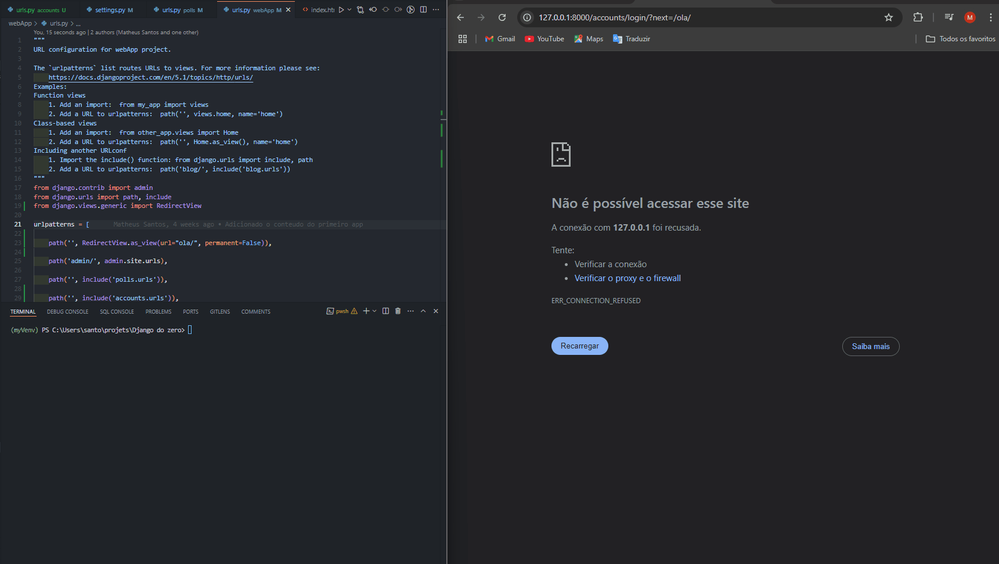

<h1 align="center">[✍️ Criação da Página de Registro e Login de Usuário 🔑]</h1>

A maioria das aplicações requer controle de acesso para proteger informações. Assim, desenvolvemos as páginas de registro de novos usários e login. Adicionamos também mais três links no nav-bar que servem para ir pra a página de registro, login ou realizar logout, sendo que no caso dos links de registro e login não irá aparecer se o usário já estiver logado.

<h2>Atividades realizadas</h2>

- Definir o redirecionamente padrão após login e logout
- Criar um novo Django app para gestão de contas de usuários (accounts)
- Criar e personalizar um form Django para Registro de usuários
- criar a view e o template para registro de usuário
- Criar as rotas específicas para gestão de contas
- Controle de acesso pela sessão logada

	

