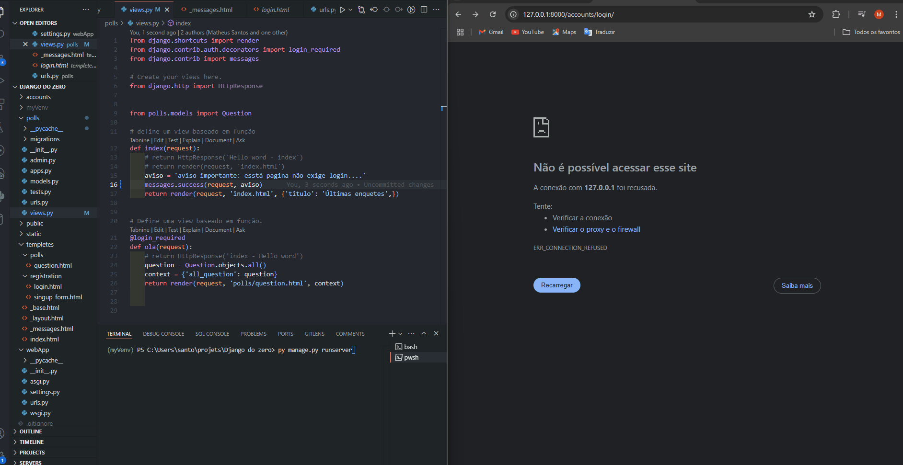

<h1 align="center">[Flash menssages⚡💬] </h1>

Mensagens que aparecem como feedback para qualquer ação do usuario. Esses elementos são fundamentais para manter os usuários informados e satisfeitos ao interagir com uma aplicação web.

## Atividades realizadas

- Configurar as clases CSS para as mensagens
- Incluir o suporte padrão de mensagfens da view do bootstrap
- Incluir a exibixão das mensagens em nosso templetess
- Testes

	

