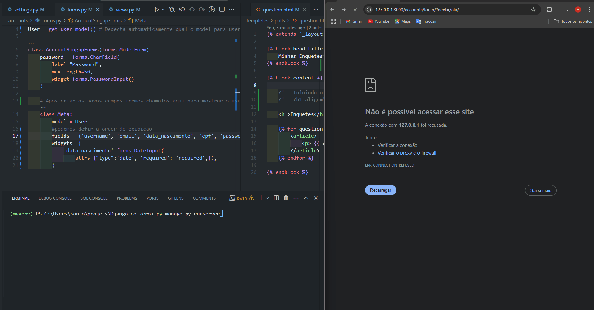

<h1 align="center">[🆕 Novos campos na tela de registro de usuários 📝👥] </h1>

Por default o Django já fornece o models.User com campos predeterminados, mas e se quisermos criar campos novos, podemos adaptar. No caso vamos fazer de uma forma bem direta.

## Atividades realizadas

- Reverter as mifgrações dos modelos de dados, para criar um Model personalizado(Campos a nosso gosto)
- Criar um Model User personalizado
- Adaptar o from de registro para coletar os novos campos
OBS.: Corrigido o botão do flash messages, o X estava do lado esquerdo, sendo correto do lado direito

### Extra
- Incluindo dados do usuário dentro da página pós login

	

